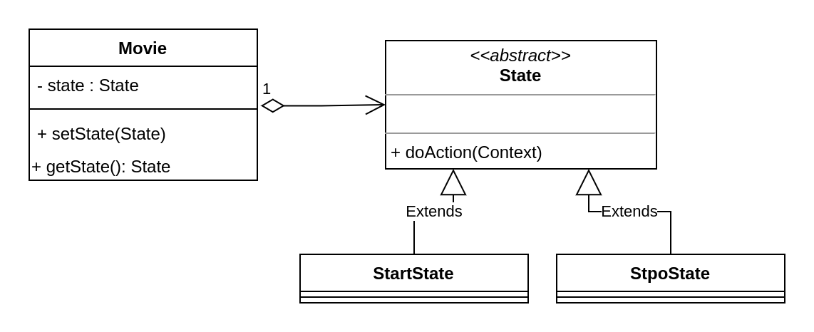

   
  <h1>Strategy pattern</h1>

## :black_nib: UML diagram 

## 💻 Running

Open the terminal or the command line in this directory and type the following commands:

`cd ./src`

`javac *`

`java Main`
